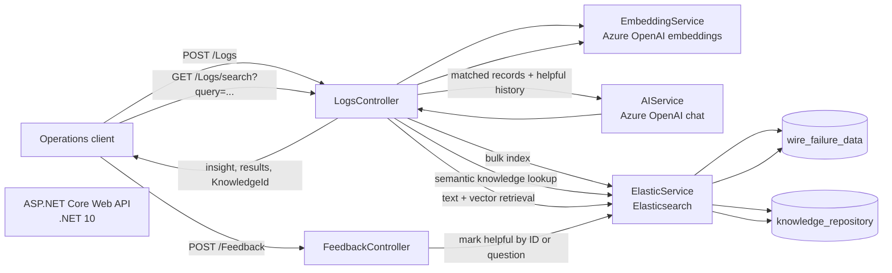

# AI-Powered Failure Monitoring API

An AI-assisted incident investigation API for payment and transaction failure logs. It combines Elasticsearch retrieval with Azure OpenAI embeddings and chat completion to help operations teams find relevant failures, investigate root causes, and reuse feedback-validated resolutions.

> **Project focus:** A practical .NET 10 example of retrieval-augmented generation (RAG), vector search, bulk ingestion, and a feedback-driven knowledge loop.

## Why it matters

Enterprise support teams often spend too much time searching fragmented logs, repeating the same investigations, and relying on undocumented experience. This project demonstrates a workflow that can:

- Reduce manual log triage by searching records with natural-language questions.
- Give analysts concise, evidence-grounded summaries of matching failure data.
- Preserve useful answers as searchable knowledge after users mark them helpful.
- Keep record-specific questions fresh, while preventing a learned answer for one wire ID from being reused for a different ID.
- Ingest batches of failure records and index them for subsequent text and vector retrieval.

These are intended operational benefits; the repository does not include benchmark or production outcome measurements.

## Architecture



### Request and learning flow

1. **Ingest:** `POST /Logs` receives a batch. The API builds searchable text for each record, generates an embedding, and bulk-indexes the records in Elasticsearch.
2. **Retrieve:** `GET /Logs/search` embeds the question. For eligible analytical questions, it first checks for similar helpful knowledge. A record-specific ID guard prevents a match for a different record ID from being reused.
3. **Analyze:** If no suitable learned answer is available, Elasticsearch retrieves failure records. Azure OpenAI receives those records and relevant helpful historical knowledge as context. Current records are treated as the primary source of truth.
4. **Learn from feedback:** Non-live analytical searches are saved in the knowledge repository. A client can submit helpful feedback using the returned `KnowledgeId`; future similar questions can retrieve that entry. This is feedback-based retrieval, not model fine-tuning.
5. **Background service:** A hosted service periodically reads helpful knowledge and writes category counts to the application log.

## API

| Method | Endpoint | Purpose |
| --- | --- | --- |
| `POST` | `/Logs` | Generate embeddings and bulk-index a batch of failure records. |
| `GET` | `/Logs/search?query={question}` | Search failure data and return an AI-generated insight, matching results, and (when applicable) a `KnowledgeId`. |
| `POST` | `/Feedback` | Mark a knowledge answer helpful by document ID, with question text as a fallback. |

### Example: ingest failure records

```http
POST /Logs
Content-Type: application/json
```

```json
[
  {
    "wireId": 1042,
    "created": "2026-08-31T12:00:00Z",
    "institution": 12,
    "status": "Failed",
    "errorCategory": "Timeout",
    "stage": "Settlement",
    "amount": 250.5,
    "currency": "USD",
    "source": "PaymentsAPI"
  }
]
```

### Example: ask an operational question

```http
GET /Logs/search?query=Why%20are%20settlement%20failures%20increasing%3F
```

A successful response includes `results` and `insight`; analytical questions may also include `knowledgeId` for feedback.

### Example: provide feedback

```http
POST /Feedback
Content-Type: application/json
```

```json
{
  "id": "<knowledgeId returned by search>",
  "question": "Why are settlement failures increasing?",
  "helpful": true
}
```

## Technology

- **ASP.NET Core Web API / C# / .NET 10** — HTTP endpoints and dependency injection.
- **Azure OpenAI** — chat completion and text embeddings, accessed through Azure Identity and `Microsoft.Extensions.AI`.
- **Elasticsearch** — bulk indexing, text and vector search, and persistence for failure logs and learned knowledge.
- **Swagger / OpenAPI** — interactive local API documentation.

## Run locally

### Prerequisites

- .NET 10 SDK.
- An Elasticsearch instance reachable by the API.
- Azure OpenAI chat and embedding deployments, with credentials available through `DefaultAzureCredential` (for example, an authenticated Azure CLI session or managed identity).

### Configure

The application reads these settings from .NET configuration:

| Setting | Purpose |
| --- | --- |
| `Azure:TenantId` | Azure tenant used by the configured credential. |
| `AzureAI:Endpoint` | Azure OpenAI chat endpoint. |
| `AzureAI:Model` | Chat deployment/model name. |
| `AzureOpenAI:Endpoint` | Azure OpenAI embedding endpoint. |
| `AzureOpenAI:EmbeddingModel` | Embedding deployment/model name. |
| `Elastic:Url` | Elasticsearch URL. |

Keep credentials out of source control. Use .NET User Secrets for local development or a managed secret store in deployed environments. For example:

```powershell
dotnet user-secrets init --project FailureMonitoringAPI/FailureMonitoringAPI.csproj
dotnet user-secrets set "Azure:TenantId" "<tenant-id>" --project FailureMonitoringAPI/FailureMonitoringAPI.csproj
dotnet user-secrets set "AzureAI:Endpoint" "<chat-endpoint>" --project FailureMonitoringAPI/FailureMonitoringAPI.csproj
dotnet user-secrets set "AzureAI:Model" "<chat-model>" --project FailureMonitoringAPI/FailureMonitoringAPI.csproj
dotnet user-secrets set "AzureOpenAI:Endpoint" "<embedding-endpoint>" --project FailureMonitoringAPI/FailureMonitoringAPI.csproj
dotnet user-secrets set "AzureOpenAI:EmbeddingModel" "<embedding-model>" --project FailureMonitoringAPI/FailureMonitoringAPI.csproj
dotnet user-secrets set "Elastic:Url" "http://localhost:9200" --project FailureMonitoringAPI/FailureMonitoringAPI.csproj
```

The Elasticsearch indices used by the service are `wire_failure_data` and `knowledge_repository`. Ensure the Elasticsearch deployment supports the vector fields and dimensions produced by the configured embedding model.

### Build and run

From the repository root:

```powershell
dotnet restore FailureMonitoringAPI/FailureMonitoringAPI.csproj
dotnet build FailureMonitoringAPI/FailureMonitoringAPI.csproj
dotnet run --project FailureMonitoringAPI/FailureMonitoringAPI.csproj
```

The configured local URLs are `http://localhost:5266` and `https://localhost:7223`. Swagger UI is available at `/swagger` while the API is running.

## Engineering considerations

- Current failure records take precedence over historical knowledge in generated answers.
- Exact ID matching is applied before reusing a learned answer, reducing cross-record contamination from highly similar embeddings.
- Direct live record lookups bypass learned-answer reuse so changing record fields are retrieved from Elasticsearch.
- Feedback updates the existing knowledge document when an ID is provided, avoiding duplicate feedback entries.
- This repository is a proof of concept. Authentication and production CORS restrictions are not configured in the current API; add them before exposing the service beyond a trusted development environment.

## Repository layout

```text
FailureMonitoringAPI/
├── Controllers/       # Log ingestion/search and feedback endpoints
├── Models/            # Failure, query, embedding, and knowledge models
├── Services/          # AI, embedding, Elasticsearch, and background services
├── Program.cs         # Dependency registration and HTTP pipeline
└── FailureMonitoringAPI.csproj
```
